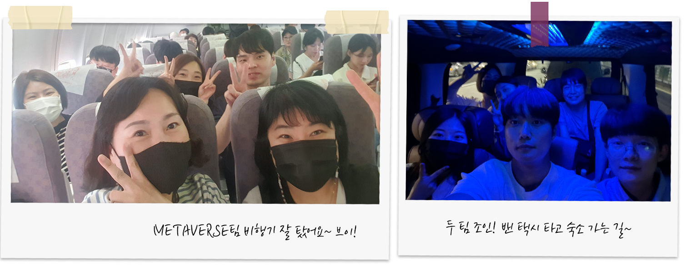
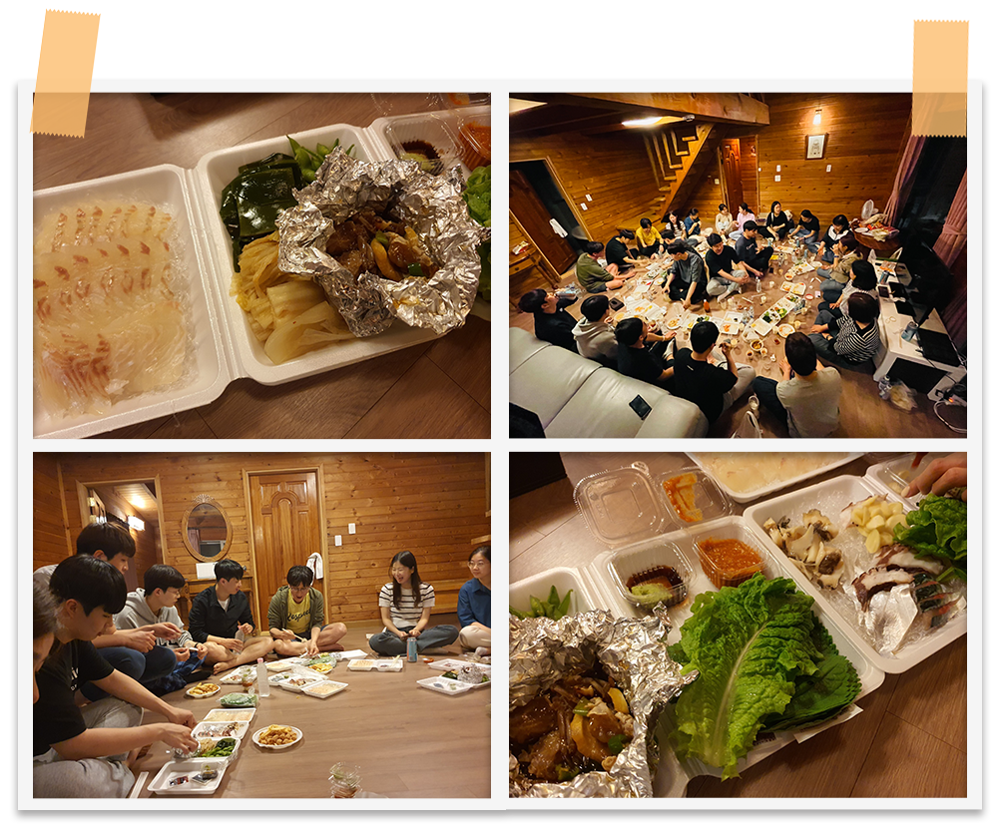
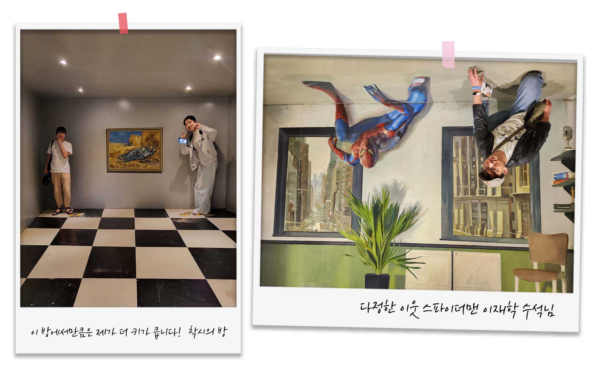
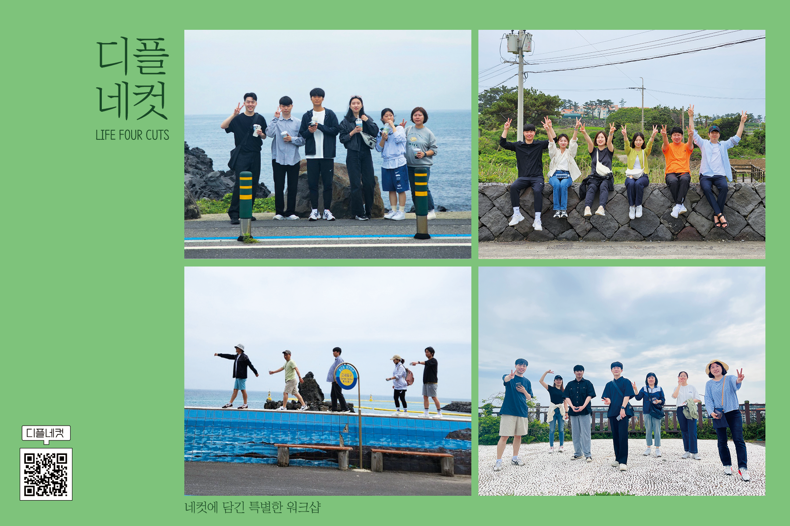

### **개요**

🗓️ 날짜: 2023년 5월 11일(목) ~ 2023년 5월 13일(토)

👥 참여인원:  총 26명

- Digital Platform본부(1) - 김용목
- Metaverse팀(12) - 최미숙, 최일주, 이경숙, 송호민, 석귀영, 이경미, 안병국, 양서정, 박상희, 백승주, 정수연, 조정우
- AI Data팀(7) - 송주홍, 윤상필, 김화영, 이주영, 방태건, 서정훈, 장서연
- Data Service팀(6) - 김건우, 이재학, 민웅기, 서정동, 김수연, 김수민

📢 준비위원:  안병국, 양서정, 서정훈, 장서연, 서정동, 김수민

### **목차**

- **Day 1**
    - 워크샵 출발
    - 리조트 도착
- **Day 2**
    - 둘째 날, 리조트 조식
    - 올레길, 애월카페거리
    - 장인의 집
    - 세미나, 아이스브레이킹
    - 디플의 밤
- **Day 3**
    - 셋째 날, 해안산책
    - 테마파크, 수목원
    - 제주동문시장
    - 다시 공항으로

  

5월 11일 목요일부터 13일 토요일까지 🏝️제주도️🏝️로 워크샵을 다녀온 디지털플랫폼 본부!!

애월읍부터 제주시 도심까지 알찬 스케줄을 마련해주신 준비위원님들, 

한결같은 텐션으로 즐겨주신 디플 본부 여러분 덕분에 워크샵이 잘 마무리 되었는데요.

지금부터 2023 디지털플랫폼 본부 상반기 워크샵 후기를 풀어보겠습니다~!

  

# Day 1 (5/11)

---

---

**# 출발, 김포공항으로**

출발은 저녁 비행기였습니다. 업무를 마친 뒤 김포공항으로 약 한 시간 가량 이동!🚗
공항에서 간단히 끼니를 해결한 후 비행기 타고 또 한 시간 슝~🛫 

설렘을 안고 비행하니 어느새 제주도에 도착해 있었습니다!🛬 혼잡한 상황을 대비해 미리 정해진 택시 팀끼리 모여 숙소로 이동해보아요~

    

---

---

**# 숙소 다인리조트**

어느새 하늘이 어두워졌네요! 택시에서 꾸벅꾸벅 졸기도 하고 창밖 야자수를 구경하기도 하며 도착한 숙소는 반짝반짝 너무 예뻤습니다.ㅎㅎ

설레는 제주도 여행의 시작으로 송주홍 팀장님과 김건우 팀장님께서 직접 공수해오신(?) 🐟회 모듬🐟 야식이 있겠습니다! 

옹기종기 모여 야식타임을 즐기는 디플~

회 종류는 광어회, 갈치회, 문어숙회 등등 다양했는데요! 제주도에서 갓 잡아올린 회여서인지 쫄깃하고 신선했답니다~ 

같이 구해오신 스끼다시🦀도 정말 맛있었죠! 역시 제주도의 간장게장이란👍
(사실 송주홍 팀장님께서 30분동안 가게 사장님의 스끼다시 생색을 들으시느라 고생하셨던 비하인드가 있답니다.🥲)

분위기가 한창 무르익어 갈 때! 송주홍 팀장님께서 가져오신 양주를 꺼내셨습니다.ㅎㅎ🥃

완벽한 비율이었던 안병국 책임님의 하이볼!🥃

디플의 밤 예행 연습이 성공적으로 끝났네요~ 내일의 일정을 위해 모두 굿나잇!🌙
    

# Day 2 (5/12)

---

---

**# 든든한 조식 뷔페**

전날 예행 연습의 여파에도 절대 놓칠 수 없다. 조식 뷔페.

시원한 바닷바람을 맞으며 호텔로 향해봅니다! 

저 멀리 보이는 시원한 바다~!

든든한 아침의 정석.jpg

종류가 많고 맛이 좋아 대다수의 디플 여러분도 만족하셨던 조식!

너무 너무 배부르다는 점이 유일한 단점이라고 할까요.ㅎㅎ 

배를 든든하게 채웠으니 올레길을 걸으러 출발!🚶‍♂️

    

---

---

**#올레길 걸어 애월카페거리로!**

디플이 묵는 다인리조트부터 애월카페거리까지 약 1시간 반 가량이 소요되는 코스! 

바다 구경을 실컷 할 수 있을 것 같아 기대가 됐답니다. ㅎㅎ 마침 햇빛이 없고 바닷바람이 불어 많이 덥지 않은 날씨였네요~🍃

올레길은 봄🌸, 여름☀️, 가을🍁, 겨울❄️ 총 4팀으로 나뉘어져 걷게 되었습니다!

올레길 걸으며 멋진 풍경 사진도 찍고~

네 팀 모두 멋진 배경과 포즈로 단체사진을 찍어주셨네요!

팀마다 융통성 있게 움직였기 때문에 카페거리에 먼저 도착한 팀도 있었고, 합류하여 같이 걸었던 팀도 있었습니다. :) 

☕**각 팀의 쉬는시간**☕

여름 팀☀️, ‘해지개’ 카페에서 다리 쭉 뻗고 휴식하기!

맛있는 도넛과 엄청난 웨이팅으로 유명한 ‘카페 노티드’에 다녀오신 겨울 팀❄️!

마지막으로, 봄 팀🌸과 가을 팀🍁은 합체되어 같이 걸었답니다.

‘봄날’ 카페에서 시원하게 물멍하며 음료 한 잔 하니 더위가 싹~ 가셨네요!

코스가 길긴 했지만 카페거리에 맛있는 음료와 디저트가 있다는 생각으로 힘내서 걸으니 금방 도착할 수 있었던 것 같습니다.

무엇보다 바다 구경을 원 없이 할 수 있었던 점이 너무너무 좋았네요~! 🌊🌊 

    

---

---

**# 수요미식회 맛집, 장인의 집!**

열심히 걸었으니 살손실(?)을 방지해야겠죠?! 올레길 일정 후 소문난 맛집이라는 ‘장인의 집’에 찾아가봅니다!

메뉴는 보기만 해도 군침이 도는 가마솥 4색 만두전골~🥟🥟

네 가지 맛의 만두와 국물의 맛이 일품이었어요!

테이블마다 붙어있는 만화를 참고하여 직접 손질도 했답니다~~

    

---

---

**# 워크샵 세미나**

세미나를 위해 옹기종기 모인 디플 여러분!

김용목 본부장님의 본부 소개 말씀 후 각 팀의 팀장님들께서 팀 소개를 해주셨습니다~!

**# 아이스 브레이킹** 🧊🔨 

이번 워크샵 스케쥴에서 가장 기대되었던 일정 중 하나! 

봄, 여름, 가을, 겨울 팀끼리 모여 앉아 게임을 시작하니 발표에 집중하느라 차분해졌던 분위기가 단숨에 띄워졌습니다~!

인물 퀴즈, 물병 던지기, 신조어 퀴즈 총 세 가지 게임이 진행됐는데요!

어찌나 치열하던지 이 순간만큼은 팀원 모두가 운명 공동체가 되어 서로를 응원했답니다~ㅎㅎ

<iframe width="768" height="431" src="https://www.youtube.com/embed/6F7Q-BeVOAk" title="디플_워크샵_아이스브레이킹_1" frameborder="0" allow="accelerometer; autoplay; clipboard-write; encrypted-media; gyroscope; picture-in-picture; web-share" referrerpolicy="strict-origin-when-cross-origin" allowfullscreen></iframe>

<iframe width="768" height="431" src="https://www.youtube.com/embed/DDAgtR85nvM" title="디플_워크샵_아이스브레이킹_2" frameborder="0" allow="accelerometer; autoplay; clipboard-write; encrypted-media; gyroscope; picture-in-picture; web-share" referrerpolicy="strict-origin-when-cross-origin" allowfullscreen></iframe>

**# 흑돼지 맛집, 뚱딴지**

신나게 놀고 다시 배를 채울 시간이 돌아왔네요! 흑돼지 먹멍🐷을 위해 숙소 근처 ‘뚱딴지’로 향했습니다.

고기가 엄청나게 두꺼운데요..! 부드럽게 먹기 위해서 소고기 스테이크처럼 80%만 익혀 먹으면 된답니다~

흑돼지 먹멍~

    

---

---

**# 디플의 밤**

드디어 디플 워크샵의 하이라이트! 디플의 밤입니다🌃 

이렇게 본부 인원이 다 같이 모여 술잔을 기울일 수 있는 자리가 평소에는 거의 없죠~

맛난 안주와 한라산과 함께 달려달려~!!🍶

    

# Day 3 (5/13)

---

---

**# 다인리조트에서의 마지막**

워크샵 마지막 날 아침이 밝았습니다🌅

역시 부지런하신 디플 여러분! 이른 아침에 산책 후 스벅 한 잔의 여유를 가지셨네요~

좋은 추억을 만들어준 다인리조트에서의 일정이 전부 끝났습니다! 아쉬움을 뒤로 한 채 버스 타고 출발..!🚎

**# 바다속고등어쌈밥**

아침을 각자 간단하게 해결하였으니 점심에는 든든하게 밥심을 채워줘야겠죠?

애월 맛집으로 소문난 ‘바다속고등어쌈밥’ 식당에서 고등어김치찜🐟과 돼지두루치기🐷를 먹었습니다!

쫄깃하고 짭짤고소한 고등어의 맛.. 그리고 맛이 없을 수가 없는 돼지두루치기! 거기에 진짜 고소한 땅콩 막걸리까지!

모두가 만족할만한 점심 식사였습니다~!

    

---

---

**# 수목원 테마파크**

다음 일정은 바로 제주도 하면 꼭 가볼만한 곳으로 손꼽힌다는 수목원 테마파크! 

실내 얼음썰매장부터 VR체험기구, 착시현상 전시 등등 즐길거리가 많은 곳입니다~ 덕분에 재미있는 사진들이 많이 찍혔네요!ㅎㅎ

추위를 잊게 만드는 재미!! 엄청난 속도감

<iframe width="768" height="431" src="https://www.youtube.com/embed/7mrzhmx7Ot8" title="디플_워크샵_테마파크" frameborder="0" allow="accelerometer; autoplay; clipboard-write; encrypted-media; gyroscope; picture-in-picture; web-share" referrerpolicy="strict-origin-when-cross-origin" allowfullscreen></iframe>

🎮 스릴 넘치는 VR 체험관

🖼️ 절묘한 착시효과를 체험할 수 있는 3D 착시관

**# 한라수목원**

수목원 테마파크에서 즐거운 시간을 보낸 디플! 테마파크 내 카페에서 가만히 쉬다 보니 뭔가 아쉽습니다. 

‘수목원 테마파크’인데 수목원에 못 가봤으니까요! 

그래서 근처에 있는 🌳'한라수목원'🌳에도 다녀와보았습니다~

푸른 녹음으로 가득한 풍경과 맑은 공기에 잔뜩 힐링하고 돌아왔답니다~🌳

    

---

---

**# 제주동문시장**

다시 버스를 타고 이번엔 쇼핑을 즐기러 가봅니다!🛍️
제주도 쇼핑하면 뭐다?! 바로 **제주동문시장**이죠? ㅎㅎ
기념품 가게와 온갖 먹음직스러운 길거리 음식을 구경하니 지갑이 자꾸 열리는 건 어쩔 수 없는 수순이었던 것 같습니다..^^💸

맛잘알 낭만잘알 디플~

복작복작한 사람들 사이에 섞여 사람냄새도 맡고👤👥
마지막까지 쇼핑리스트를 위해 알뜰하게 시장 구석구석을 누빈 디플! 각자 하나 이상의 봉투를 들고 계셨던 게 기억에 남습니다. ㅎㅎ 

이제 사람들을 헤치고 여기저기 돌아다니며 소비한 에너지를 채워야겠죠!
'**삼대국수회관**'에서 제주도의 소울푸드인 고기국수로 완벽한 마지막 한 끼를 마무리했답니다~🍜
국물에서 깊고 깔끔한 맛이 나서 맛집을 제대로 찾아온 느낌이었어요!

    

---

---

**# 공항으로**

수목원 테마파크🌳부터 동문시장 쇼핑🛍️까지!
긴 여정을 보내고 국수집에서 빠르게 식사를 마친 디플 본부. 시간이 조금 남아 마지막으로 거대 하르방 앞에서 사진을 남겨보았습니다~

🚎 아쉽지만 다시 버스를 타고 공항으로~

앗, 비행기 타기 전에 잠깐! 아이스 브레이킹 팀별 순위 공개 및 시상이 아직 남았습니다!

봄🌸, 여름☀️, 가을🍁, 겨울❄️ 최종 순위를 공개합니다~~🎊 

상품은 바로 스타벅스 상품권! 나중에 팀끼리 모여 뒤풀이로 티타임을 가질 수 있겠네요~! ㅎㅎ

이렇게 워크샵 공식 일정이 전부 끝났습니다!! 와아~👏👏
2박 3일이 길다면 긴 시간인데, 막상 지나고 나니 짧기만 한 것 같습니다.🥲 그만큼 재미있었던 워크샵이었고, 다같이 단합하며 서로 더 알아가고 친해질 수 있었던 소중한 시간이었습니다!

제주도 워크샵 기회를 마련해주신 본부장님과 각 팀의 팀장님들께, 알차고 즐겁고 맛있는 일정을 기획해주신 준비위원님들께 무한한 감사의 말씀을 드리며 이만 후기를 마쳐보겠습니다.😊♥️

이제 정말 집에 가요! 끝~!🛬

    

---

**보너스!!** 베스트 컷으로 만든 ****디플네컷~

