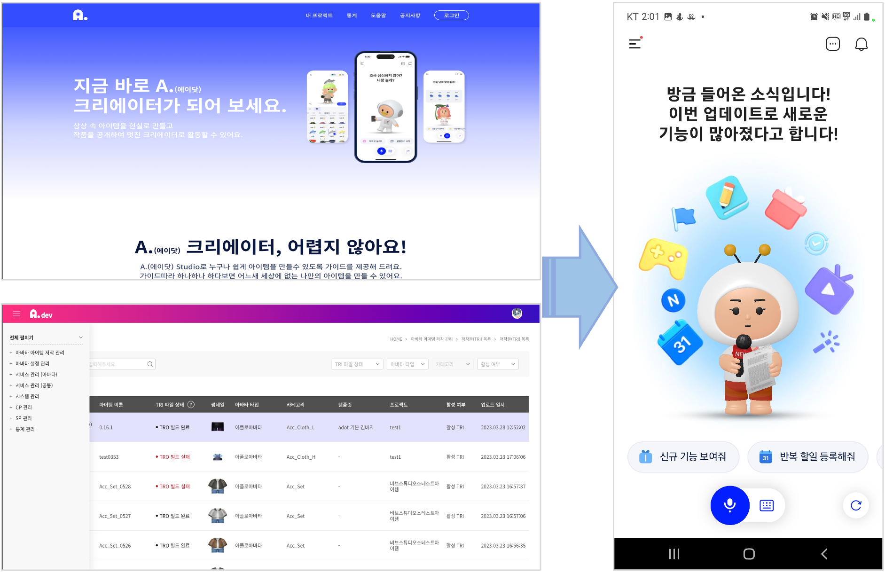

# A. Studio 서비스 플랫폼 구축

### SK텔레콤 A. Studio 서비스 플랫폼 구축 및 운영 지원
</br>

A. Studio 서비스의 Portal, API, Admin, 아이템 Build 기능 등을 고도화 하며, 멀티 캐릭터를 등록하고 관리하는 기능을 지원하였습니다.

> **Period:** 2022.08 ~ 24.02.29 
> 
> **Role:** 서비스 플랫폼 구축 및 고도화 운영 (Creator Portal, API, Admin, Build Engine 기능 개발 및 고도화) 
> 
> **Description:**  캐릭터 및 아이템을 제작하고 에이닷 App 에서 서비스할 수 있는 아이템 저작 플랫폼 
> 
> **History:**
> ``` 
> - 2023.01.30 : A. Studio 서비스 사내 오픈
> ```


