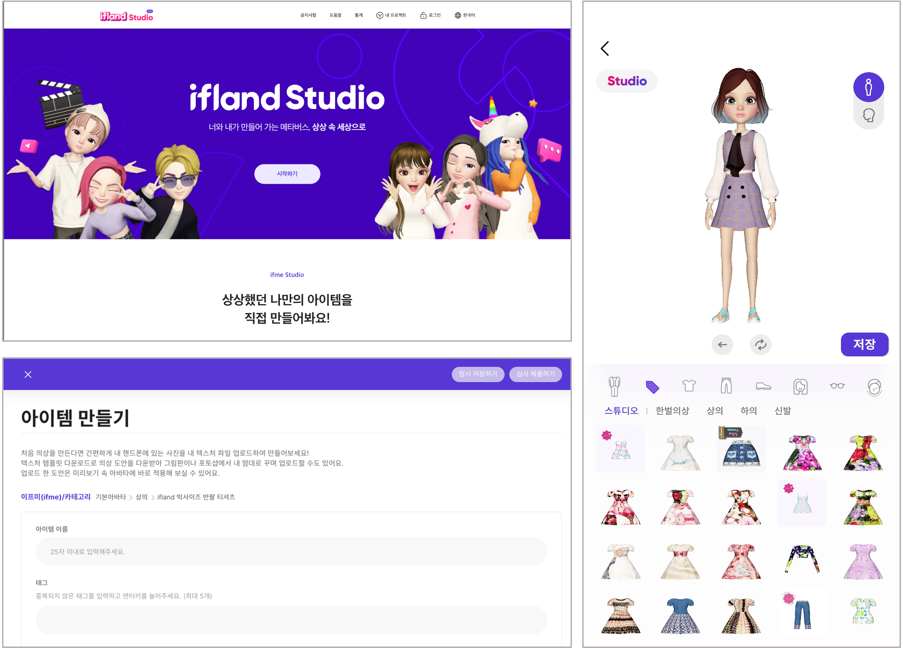

# ifland Studio 서비스 플랫폼 구축

### SK텔레콤 ifland Studio 서비스 플랫폼 구축 및 운영 지원
</br>

현재 ifland Studio 서비스의 Portal, API, Admin, 아이템 Build 기능 등을 고도화 하며, 아이템 저작 플랫폼 서비스를 제공하도록 지원하고 있습니다.

> **Period:** 2021.04 ~ 현재 
> 
> **Role:** 서비스 플랫폼 구축 및 고도화 운영 (Creator Portal, API, Admin, Build Engine 기능 개발 및 고도화) 
> 
> **Description:**  크리에이터가 아이템을 제작하고 ifland App 에서 판매하고 서비스할 수 있도록 아이템 저작 플랫폼 
> 
> **History:**
> ``` 
> - 2023.08.31 : Azure Kubernetes System 인프라 전환
> - 2022.09.03 : ifland Studio 베타 서비스 오픈
> ```



