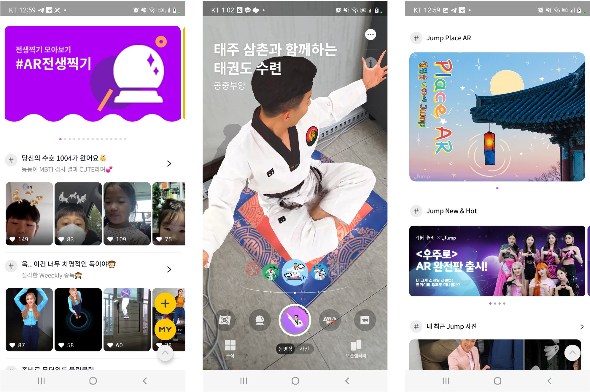

# Jump 서비스 플랫폼 구축

### SK텔레콤 Jump 서비스 플랫폼 구축 및 운영 지원
</br>

Jump 서비스의 API, Admin 기능 등을 고도화 하며, AR 콘텐츠를 등록하고 관리하는 기능을 지원하였습니다.

> **Period:** 2019.07 ~ 23.04.30 
> 
> **Role:** 서비스 플랫폼 구축 및 고도화 운영 (Portal, API 기능 개발 및 고도화) 
> 
> **Description:**  Jump App 에서 AR 콘텐츠를 등록/관리할 수 있는 기능과 콘텐츠를 Curation 하는 기능을 제공하는 서비스 플랫폼 
> 
> **History:**
> ``` 
> - 2019.08 : Jump AR 상용화
> ```

