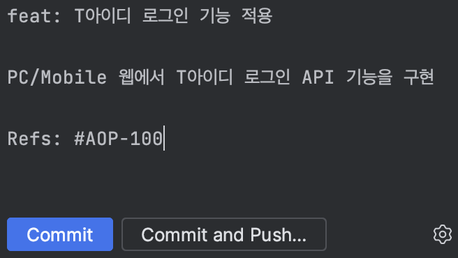

> \*\*해당 글은 테스트를 위해 임시로 작성된 포스트 입니다. 추후 새롭게 작성될 예정입니다.

안녕하세요! 메타버스팀에서 백엔드 개발을 담당하고 있는 백승주 선임 입니다.  
회사/개인 프로젝트에서 Git이라는 형상관리 툴을 대표적으로 많이 사용하고 있습니다.  
Git을 사용할 때, 프로젝트 상황에 맞춰 다양한 방법론과 규칙을 적용할 수 있습니다.  
이번 글에서는 Git Commit 메시지 규칙에 대해 알아보도록 하겠습니다.  
프로젝트에서 Git Commit 메시지를 표준화 하면 변경 사항을 보다 명확하게 파악할 수 있으며, 협업과 코드 리뷰 과정에서도 큰 도움이 됩니다.
경험이 많은 개발자분들께서는 당연하게 생각하실 수 있는 내용이지만,  
실무 경험 또는 프로젝트 경험이 적은 개발자분들께 도움이 될 수 있도록 쉽게 정리해서 설명드리겠습니다.

### Git Commit Message 기본 구조

Git Commit Message 기본 구조는 다음과 같습니다.

```
<타입>[적용 범위(선택 사항)]: <설명>

[본문(선택 사항)]

[꼬리말(선택 사항)]
```

이해를 돕기 위해서,  
현재 메타버스팀에서 진행중인 ifland Studio 프로젝트의 간단한 커밋 메시지를 보여드리겠습니다.

```
feat: T아이디 로그인 기능 적용

PC/Mobile 웹에서 T아이디 로그인 API 기능을 구현

Refs: #AOP-100
```

1번 라인은 제목과 간결한 변경 사항을 작성하는 영역이며, 필수 사항입니다. 제목은 최대 50자를 넘지 않도록 작성하는 것이 좋습니다.  
2번 라인은 공백을 작성합니다.  
3번 라인은 본문을 작성하는 영역이며, 선택 사항입니다. 변경 사항에 대해 자세한 설명을 작성합니다.  
4번 라인은 공백을 작성합니다.  
5번 라인은 꼬리말 작성하는 영역이며, 선택 사항입니다. 일반적으로 이슈 트래킹을 위해 이슈 번호를 작성합니다.

### 다양한 종류의 타입

1번 라인에서 <타입> 영역은 변경 사항의 성격에 따라 작성합니다. 타입 유형은 다음과 같습니다.

> _feat:_ 신규 기능 추가  
> _fix:_ 버그 수정  
> _refactor:_ 리팩터링 (중복 코드 제거, 클래스 또는 메서드명 수정 등)  
> _style:_ 코드 스타일 수정 (기능과 로직에 영향을 주지 않는 변경)  
> _chore:_ 기타 코드 수정  
> _test:_ 테스트 코드 추가/수정  
> _docs:_ 개발 문서 수정

##### Git Commit Message 규칙을 가지고 코드를 관리하면, 협업 능력을 향상시킬 수 있고, 코드 리뷰 과정에서 도움을 받을 수 있습니다.

##### 좋은 규칙과 습관을 익히면서 실무에서 더 나은 개발자로 성장하길 바라겠습니다.

---

#### Git Commit Message Image Example...


