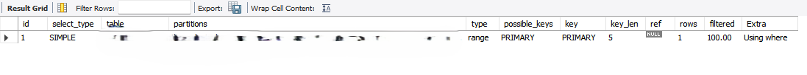
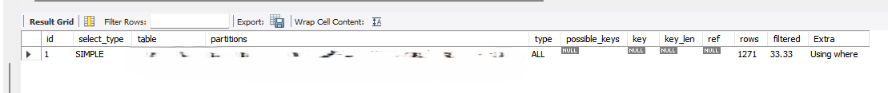

### DETERMINISTIC 과 NOT DETERMINISTIC 이란?

Real MySQL 8.0 2권 p344~ 부터 DETERMINISTIC 과 NOT DETERMINISTIC 의 일부 내용을 발췌 해보면... 

```
DETERMINISTIC이란 "스토어드 프로그램의 입력이 같다면 시점이나 상황에 관계없이 결과가 항상 같다(확정적이다)"를 의미하는 키워드다.

반대로 NOT DETERMINISTIC이란 입력이 같아도 시점에 따라 결과가 달라질 수도 있음을 의미한다.

일반적으로 일회성으로 실행되는 스토어드 프로시저는 이 옵션의 영향을 거의 받지 않는다.(why?~)
하지만 SQL 문장에서 반복적으로 호출될 수 있는 스토어드 함수는 영향을 많이 받으며, (조금 why?~)
쿼리의 성능을 급격하게 떨어뜨리기도 한다.(why?~)

...결국 NOT DETERMINISTIC으로 정의된 스토어드 함수는 절대 상수가 될 수 없다.

더 중요한 점은 이렇게 풀 테이블 스캔을 유도하는 NOT DETERMINISTIC 옵션이 스토어드 함수의 디폴트 옵션이라는 것이다.
```

### 테스트를 해보자!

멱등성을 이야기 하는 줄 알았는데... 상수가 될 수 없어도 함수의 리턴값은 상수인데 왜 인덱스가 타지 않을 수 있지? 테스트로 확인 해보자.

```
CREATE FUNCTION `sf_getdate_deter`() RETURNS datetime
    DETERMINISTIC
BEGIN
    RETURN now();
END

explain
select *
from table
where login_datetime > sf_getdate_deter();

```



```
CREATE FUNCTION `sf_getdate_deter_not`() RETURNS datetime
    NOT DETERMINISTIC
BEGIN
    RETURN now();
END

explain
select *
from table
where login_datetime > sf_getdate_deter_not();

```



### 생각 좀 해보자!

NOT DETERMINISTIC 으로 하면 리턴 값이 일정하다 안하다의 멱등성 이야기라기 보다 sf_getdate_deter_not() 결과값을 상수값으로 취급을 안한다? 위와 같이 동작한다면 경우에 따라 성능이...으아아...

스칼라 서브쿼리에서 쓰이는 경우는 어떻게 되는걸까? 스칼라 서브쿼리는 캐싱되서 재활용 되는 것으로 알았는데 그보다 함수의 상수화 방향인건가? 이건 좀 추후 다시 알아봐야겠다.

### 결론

```
일단 DETERMINISTIC 옵션을 주어서 함수를 만드는게 좋겠다.
무조건은 아니지만...
근데 왜 MySQL 에서 NOT DETERMINISTIC 옵션이 기본값인거지?
```