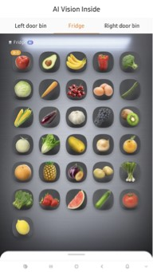

# 2024 CES를 통해 본 AI 트렌드 조사

> CES에서 가장 큰 관심사는 AI
다양한 AI 업체들이 참여
기존 IT 업체들도 자사 솔루션/서비스에 생성형 AI 기술 접목
> 

## [Baby Monitor] Cappella

- 아기 울음 소리를 감지하고 분석하여 각 육아 상황에 맞는 솔루션 실행

<iframe width="866" height="487" src="https://www.youtube.com/embed/rjFppkhjvwE" title="Introducing Cappella!" frameborder="0" allow="accelerometer; autoplay; clipboard-write; encrypted-media; gyroscope; picture-in-picture; web-share" referrerpolicy="strict-origin-when-cross-origin" allowfullscreen></iframe>

## [Beauty] L'Oréal (Beauty Genius)

- 얼굴 사진 정보를 활용해 피부 톤과 상태 등을 확인하고 적합한 화장품이나 화장법을 추천

## [Humanoid Robot] Figure AI (Figure 01)

- Open AI와 협업을 통해 개발한 자신을 둘러싼 환경에서 스스로 판단하고 행동하는 휴머노이드 로봇

<iframe width="866" height="487" src="https://www.youtube.com/embed/Sq1QZB5baNw" title="Figure Status Update - OpenAI Speech-to-Speech Reasoning" frameborder="0" allow="accelerometer; autoplay; clipboard-write; encrypted-media; gyroscope; picture-in-picture; web-share" referrerpolicy="strict-origin-when-cross-origin" allowfullscreen></iframe>

## [Smart Home] Samsung (AI Vision Inside)

- 냉장고 내부 카메라가 식재료를 인지하여 푸드 리스트를 관리

## [XR] Apple (Vision Pro)

- 사용자의 얼굴을 촬영하여 머신 러닝을 통해 가상의 아바타 생성

<aside>
💡 결론 : AI는 선택이 아닌 필수

</aside>