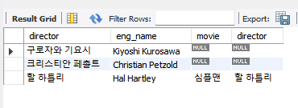
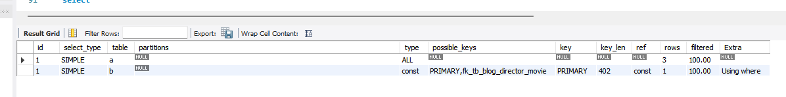
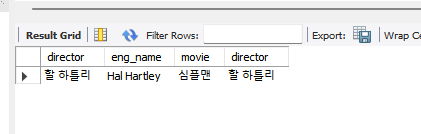
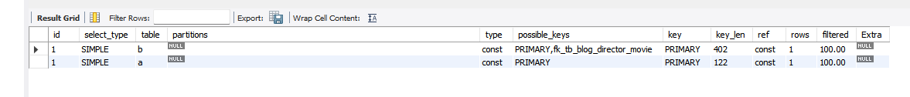
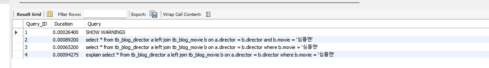
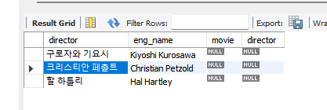
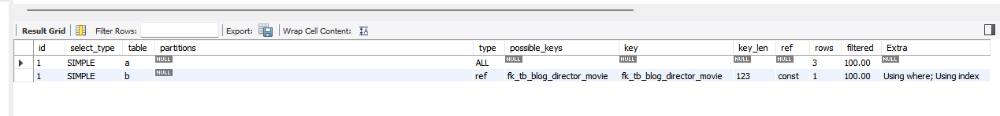
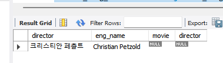
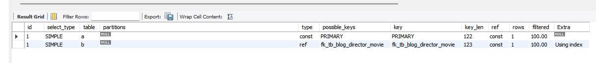

# Outer Join 시 조건을 on에 걸어야 하나? where 걸어야 하나? 그게 그거겠지?

## 그게 그거 아니다!!!

### Q1.on과 where 조건이 다른가요?

### A1.다름. 후려쳐서 말하면...
on : join 을 하기전에 필터링을 함
where : join 을 한후 필터링을 함

이런 차이가 innner join 의 결과는 다르지 않치만 outer join 결과는 차이가 난다.

Q2.그래요? 전 잘 못느꼈는데요?

A2.1 음... 그럼 아래처럼 테이블을 만들고 데이타를 만들고 나서 테스트를 해보자.

```jsx
<감독 테이블>
CREATE TABLE IF NOT EXISTS tb_blog_director (
director VARCHAR(30) NOT NULL COMMENT '감독',
eng_name VARCHAR(30) NOT NULL COMMENT '영문이름',
PRIMARY KEY (director))
ENGINE = InnoDB;
```

```jsx
<영화 테이블>
CREATE TABLE IF NOT EXISTS tb_blog_movie (
movie VARCHAR(100) NOT NULL COMMENT '영화',
director VARCHAR(30) NULL COMMENT '비밀번호',
PRIMARY KEY (movie),
CONSTRAINT fk_tb_blog_director_movie
FOREIGN KEY (director)
REFERENCES tb_blog_director (director)
ON DELETE NO ACTION
ON UPDATE NO ACTION)
ENGINE = InnoDB;
```

<테스트용 데이타 넣기>

```jsx
INSERT INTO tb_blog_director (director, eng_name)
VALUES
('할 하틀리','Hal Hartley'),
('구로자와 기요시','Kiyoshi Kurosawa'),
('크리스티안 페촐트','Christian Petzold');
```

```jsx
INSERT INTO tb_blog_movie (movie, director)
VALUES
('심플맨','할 하틀리'),
('트러스트','할 하틀리'),
('아마추어','할 하틀리'),
('큐어','구로자와 기요시'),
('산책하는 침략자','구로자와 기요시'),
('알프레도 가르시아의 목을 가져와라',null);
```

### A2.2 테스트 데이타가 준비 되었으니 아래 처럼 SQL을 실행해서 비교해보자.

```jsx
set profiling=1;
```

```jsx
select *
from tb_blog_director a left join tb_blog_movie b
on a.director = b.director
and b.movie = '심플맨';
```



sql 결과 1                                  



sql plan 1


sql profile1

```jsx
select *
from tb_blog_director a left join tb_blog_movie b
on a.director = b.director
where b.movie = '심플맨';
```



sql 결과 2



sql plan 2



sql profiles 2

위의 결과 같이 다르다.
오라클에서 아웃터 조인시 드리븐 테이블의 컬럼에 조건이 걸면 아웃터 조인이 먹지 않는 것처럼
mysql은드리븐 컬럼의 조건을  where 절에 걸면 inner join과 같은 결과가 나온다.

단, 드라이빙 컬럼에 조건을 걸어 필터링 하고 싶다면 on절에 걸면 필터링 되지 않는다.
where 절에 걸어야만 필터링이 된다.

이 내용도 테스트 해볼까?

```jsx
select *
from tb_blog_director a left join tb_blog_movie b
on a.director = b.director
and a.director = '크리스티안 페촐트';
```



sql 결과 3

                                                                                                 



sql plan 3

                                                                         

```jsx
select *
from tb_blog_director a left join tb_blog_movie b
on a.director = b.director
where a.director = '크리스티안 페촐트';
```



sql 결과 4

                                                                                                        



sql plan 4

    

Q3. 나도 몇가지 질문하고 싶은게 있다. 이제 당신이 대답해주실 바란다.

1. inner join 인 경우에 on과 where 조건의 결과도 성능도 같다고 하는데, 결과는 같겠지만 조인대상 건수가 달라질수 있는데 성능이 항상 동일할까?
2. MySQL 옵티마이저는where 절의 조건이 걸리면 left join을 inner join으로 변환해서 실행 한다고 한다. 결과적으로는 맞는데 과연 그런가?
2-1) MySQL 5.6.7 부터 show profile, show profiles 명령어가 deprecated 되긴 했지만 (테스트 MySQL은 8.0.31) , show profiles; 실행후 나온 sql이 실행SQL이
맞다면 변화는 없음. 이게 실행 SQL 이 맞다면?
2-2) 또한 조건이 드리븐 컬럼 이라면 위에 설명이 맞지만 드라이빙 컬럼의 경우는 다른거 같은데...

