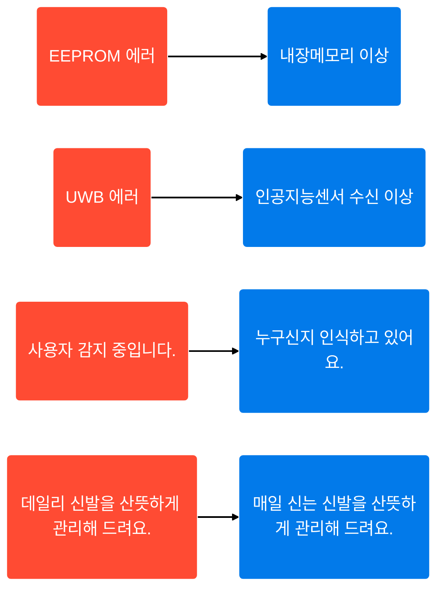
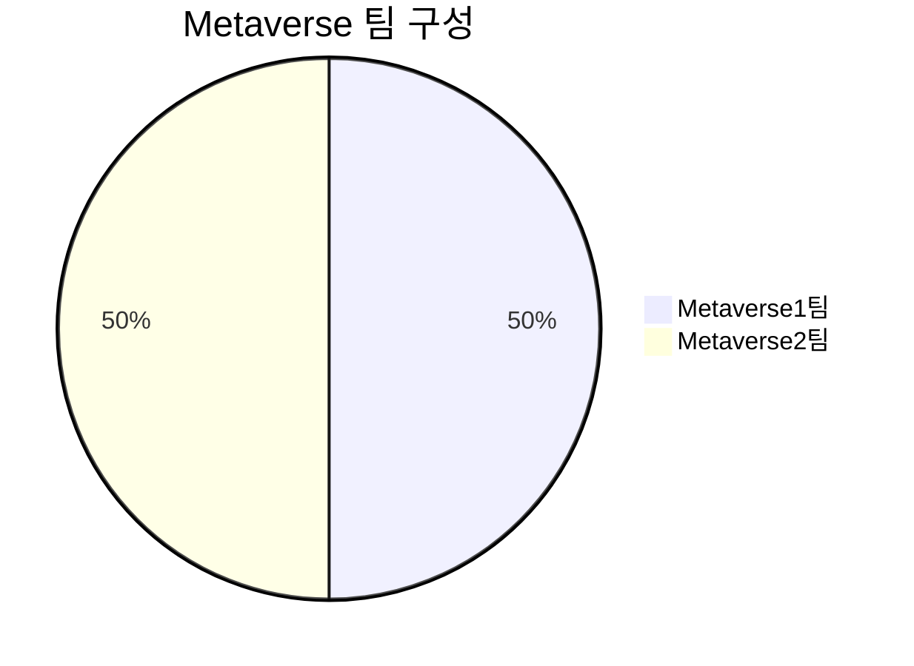

# UX Writing 개요

## **UI 텍스트를 작성할 때 UX Writing은?**

- **UX** : UX를 고려해 UI 텍스트를 작성하는 일
- **Branding** : 브랜드 방향성을 UI 텍스트에 반영하는 일
- **Consistency** : 일관성 있게 UI 텍스트를 작성하는 일

<aside>
✍🏻 기본 원칙 + 브랜드 방향성 = UX Writing

</aside>

## 기본 원칙

1. **Clear** : 사용자가 익숙한 용어로 **“명확하게”** 쓴다.
2. **Concise** : 사용자에게 꼭 필요한 정보만 **“간결하게”** 쓴다.
3. **Useful** : 사용자에게 도움이 되도록 **“유용하게”** 쓴다.

## 브랜드 방향성

- 회사 또는 프로젝트마다 방향성이 다르다.
- 브랜드 방향성은 **“보이스”**와 **“톤”**으로 나타난다.

---

# 원칙 1. Clear

### 사용자가 익숙한 단어로

- 전문 용어는 누구나 알기 쉽게 풀어쓴다.
- 사용자에게 불편함을 주지 않는 어휘를 사용한다.

> EEPROM 에러 ⇒ 내장메모리 이상
UWB 에러 ⇒ 인공지능센서 수신 이상
사용자 감지 중입니다. ⇒ 누구신지 인식하고 있어요.
데일리 신발을 산뜻하게 관리해 드려요. ⇒ 매일 신는 신발을 산뜻하게 관리해 드려요.
> 

<aside>
❌ **Don’t**
EEPROM 에러

</aside>

<aside>
✅ **Do**
내장메모리 이상

</aside>

### 쉬운 표현으로

- 어린이가 봐도 이해할수 있도록 쉬운 표현을 사용한다.
- 한자어나 외국어는 꼭 필요한 상황에만 사용한다.

> 사용 패턴에 따라 코스 순서가 자동으로 정렬됩니다. ⇒ 자주 사용하는 코스가 먼저 표시됩니다.
필터 청소를 완료했습니다. ⇒ 필터 청소가 끝났습니다.
사용 내역 ⇒ 사용 기록
일시 정지 ⇒ 잠시 멈춤
> 

### 단순한 구조로

- 문장을 이중 구조로 작성하지 않는다.

> 항상 기후나 도로 조건에 적합한 안전한 속도로 주행하십시오. ⇒ 항상 기후나 도로 조건에 적합한 속도로 안전하게 주행하십시오.
확인 버튼을 누르면 색상과 음악을 변경할 수 있어요. ⇒ 색상과 음악을 변경하려면 '확인' 버튼을 누르세요.
확인을 눌러 코스를 선택/선택해제하고 이전을 눌러 저장할 수 있습니다. ⇒ 코스를 선택하거나 선택 해제하려면 '확인'을 눌러주세요. 변경 내용을 저장하려면 '이전'을 눌러주세요.
> 

---

# 원칙 2. Concise

### 꼭 필요한 정보만

### 짧은 문장으로

### 명사보다는 동사로

# 원칙 3.Useful

### 중요한 정보는 눈에 띄게

### 사용자가 길을 잃지 않게

### 빨리 실행할 수 있게

