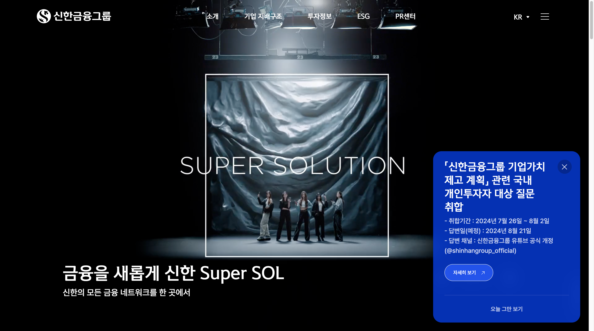
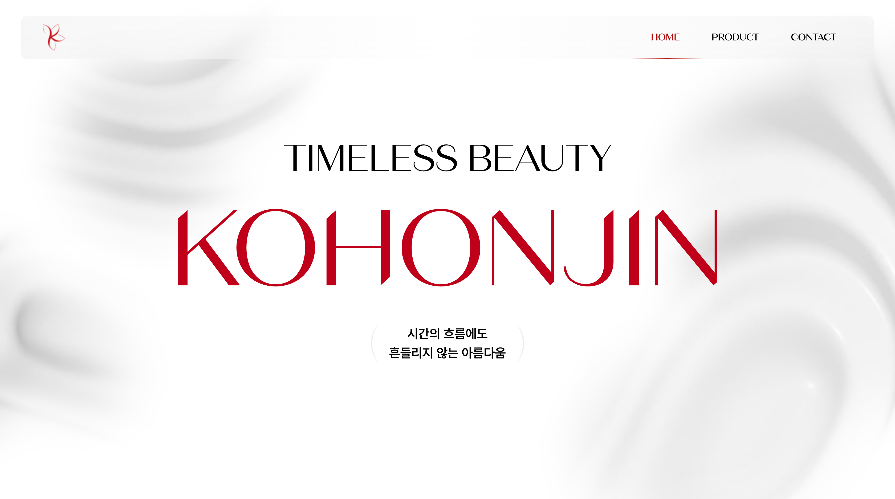
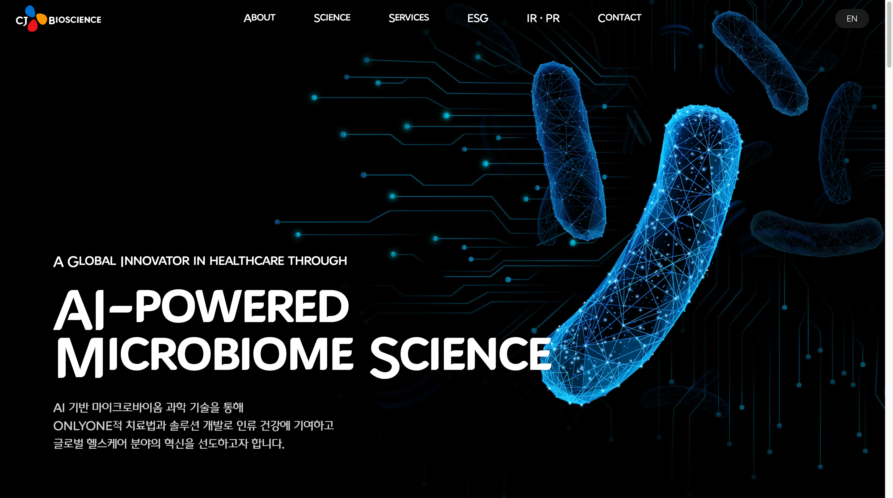
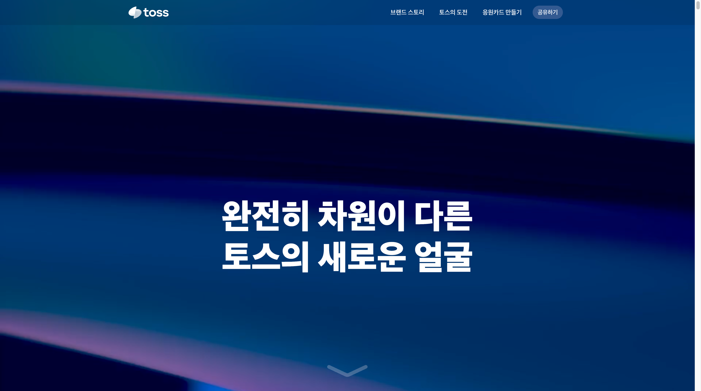

# 웹 UI의 핵심 요소: Hero Section

웹 UI 디자인에서 "Hero"라는 용어는 마케팅과 광고에서 유래한 개념입니다. 신문이나 잡지의 첫 페이지, 중요한 광고 영역에서 주목을 끌기 위해 사용되던 큰 이미지나 메시지에서 그 기원을 찾을 수 있습니다. 디지털 시대에 접어들면서, 이 개념은 웹 디자인과 사용자 인터페이스 디자인으로 옮겨왔습니다. 이번 포스트에서는 "Hero"의 유래와 웹 UI에서의 사용에 대해 자세히 알아보겠습니다.

## Hero의 유래

### 1. 마케팅 및 광고 기원

"Hero"는 독자나 소비자의 주의를 끌기 위한 전략으로 대형 비주얼 요소를 가리켰습니다. 이는 중요한 메시지나 광고를 전달하기 위해 사용되었습니다.

### 2. 웹 디자인으로의 전환

웹 디자인에서는 "Hero"가 웹 페이지의 가장 눈에 띄는 부분을 의미하게 되었습니다. 일반적으로 페이지 상단에 위치하며, 큰 이미지나 비디오, 중요한 메시지 또는 콜투액션(CTA)을 포함합니다.

## Hero 섹션의 명칭 이유

"Hero"라는 용어가 웹 UI에서 사용되는 이유는 다음과 같습니다:

### 1. 눈에 띄는 존재

영웅(Hero)은 이야기나 서사에서 가장 중요한 역할을 맡는 캐릭터로, 주목을 받는 존재입니다. 웹 페이지에서도 "Hero" 섹션은 사용자에게 가장 먼저 눈에 띄는 중요한 영역이므로 이 섹션이 "Hero"라고 불리게 되었습니다.

### 2. 중요한 메시지 전달

영웅은 종종 중요한 메시지나 임무를 전달하는 역할을 합니다. 웹 페이지의 Hero 섹션도 비슷하게 중요한 정보를 전달하고, 사용자가 페이지에서 무엇을 기대할 수 있는지 명확히 알려줍니다.

### 3. 강한 시각적 임팩트

영웅은 강력하고 인상적인 존재로 묘사됩니다. 웹 UI의 Hero 섹션도 시각적으로 강렬한 요소(예: 큰 이미지, 동영상, 굵은 헤드라인)를 포함하여 사용자에게 강한 첫 인상을 남깁니다.

## Hero의 목적

### 1. 주목 끌기

첫 인상에서 사용자의 주목을 끌기 위해 시각적으로 강력한 요소를 사용합니다.

### 2. 핵심 메시지 전달

웹사이트나 제품의 주요 메시지를 빠르게 전달합니다.

### 3. 브랜드 인식 강화

브랜드의 핵심 가치를 강조하고 기억에 남게 합니다.

### 4. 행동 유도

CTA 버튼을 포함하여 사용자가 원하는 행동을 취하도록 유도합니다.

## Hero의 구성 요소

### 1. 대형 배경 이미지 또는 비디오

시각적으로 매력적이고 페이지의 분위기를 설정합니다.

### 2. 헤드라인

강렬하고 간결한 메시지로 사용자에게 중요한 정보를 전달합니다.

### 3. 서브헤드라인

추가 정보를 제공하거나 헤드라인을 보완합니다.

### 4. CTA 버튼

사용자가 바로 행동을 취할 수 있도록 유도합니다.

## Hero UI의 최신 트렌드

### 1. 비디오 배경

정적인 이미지 대신 비디오를 배경으로 사용하여 더 강렬하고 몰입감 있는 사용자 경험을 제공합니다.

### 2. 미니멀리즘 디자인

간결하고 깔끔한 디자인으로 중요한 메시지를 강조하고 불필요한 요소를 제거합니다.

### 3. 애니메이션과 마이크로인터랙션

작은 애니메이션이나 인터랙션 요소를 추가하여 사용자와의 상호작용을 흥미롭게 만듭니다.

### 4. 타이포그래피 중심 디자인

큰 글꼴과 독특한 타이포그래피를 사용하여 강렬한 메시지를 전달합니다.

### 5. 다양한 레이아웃

전통적인 한 개의 Hero 이미지 대신 여러 개의 이미지를 슬라이더로 보여주거나 그리드 형태로 배치하여 다양한 메시지를 전달합니다.

### 6. 3D 그래픽과 AR/VR 요소

3D 그래픽과 증강현실(AR), 가상현실(VR) 요소를 활용하여 더욱 몰입감 있는 경험을 제공합니다.

### 7. 퍼스널라이제이션

사용자의 데이터나 행동을 기반으로 맞춤형 Hero UI를 제공하여 더욱 개인화된 경험을 제공합니다.

### 8. 다크 모드

눈의 피로를 줄여주고, 시각적으로 고급스러운 느낌을 줄 수 있는 다크 모드 디자인이 인기를 끌고 있습니다.

### 9. 패럴랙스 스크롤링 효과

스크롤할 때 배경 이미지와 전경 요소가 다른 속도로 움직이는 패럴랙스 효과를 사용하여 깊이감과 동적인 경험을 제공합니다.

### 10. 고해상도 이미지와 그래픽

고해상도 이미지와 그래픽을 사용하여 시각적 품질을 높이고, 사용자가 더 세밀한 디테일을 경험할 수 있도록 합니다.

## 국내 기업 사례

### 1. 비디오 배경을 사용한 신한금융그룹

[https://shinhangroup.com/kr/main](https://shinhangroup.com/kr/main)

### 2. 간결한 디자인과 타이포그래피 중심의 고혼진

[https://kohonjin.com/](https://kohonjin.com/)

### 3. 다크 모드를 이용해 시각적 집중도를 높인 CJ 바이오사이언스

[https://www.cjbioscience.com/](https://www.cjbioscience.com/)

### 4. 패럴럭스 스크롤링 효과를 사용한 toss 브랜드 스토리

[https://toss.im/new-dimension/brand-story](https://toss.im/new-dimension/brand-story)

## 결론

Hero 섹션은 웹 UI 디자인에서 매우 중요한 요소로 자리 잡았으며, 사이트 방문자에게 강력한 첫 인상을 주는 데 중요한 역할을 합니다. 최신 트렌드를 반영하여 디자인하는 것은 사용자 경험을 극대화하고 브랜드의 메시지를 효과적으로 전달하는 데 필수적입니다. 앞으로도 계속 진화하는 Hero UI 트렌드를 주목하면서, 보다 창의적이고 효과적인 디자인을 추구해보세요.